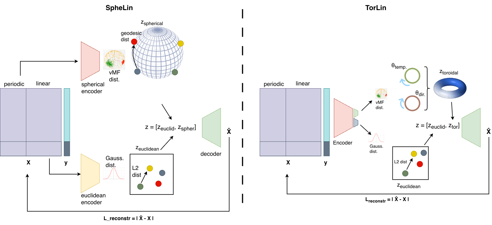

This repo contains forays into a large amount of methods researched for timeseries (and some tabular) data prediction in regression. Considered methods include components:
- multi-layer perceptron (MLP)
- [variational] autoencoders (VAE)
- Conditional VAE (C-VAE)
- β-VAE
- CNN
- Barlow twins
- TS2Vec
- TimeVAE
- MOMENT
- Long Short Term Memory (LSTM)

In addition to hyperparam search, benchmarking, evaluation metrics

More recently, I pivoted to a topological-geometric approach (see `geo` folder), hoping to gain novel insights and inductive biases. I used a combination of the above components, plus the following (some are borrowed from others, some are homemade): spherical MLP/LSTM encoders, toroidal MLP/LSTM encoder, von Mises-Fisher sampling, manifolds ...

